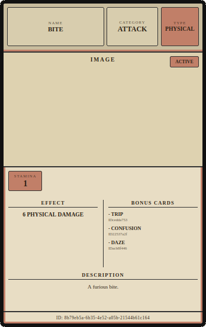
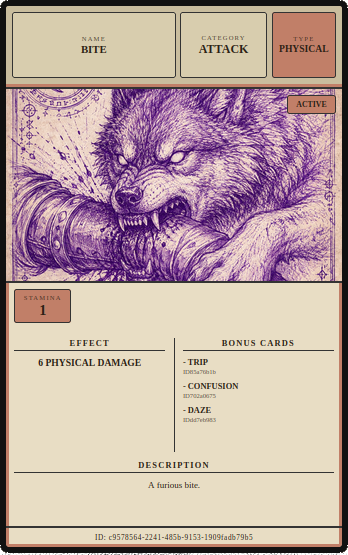
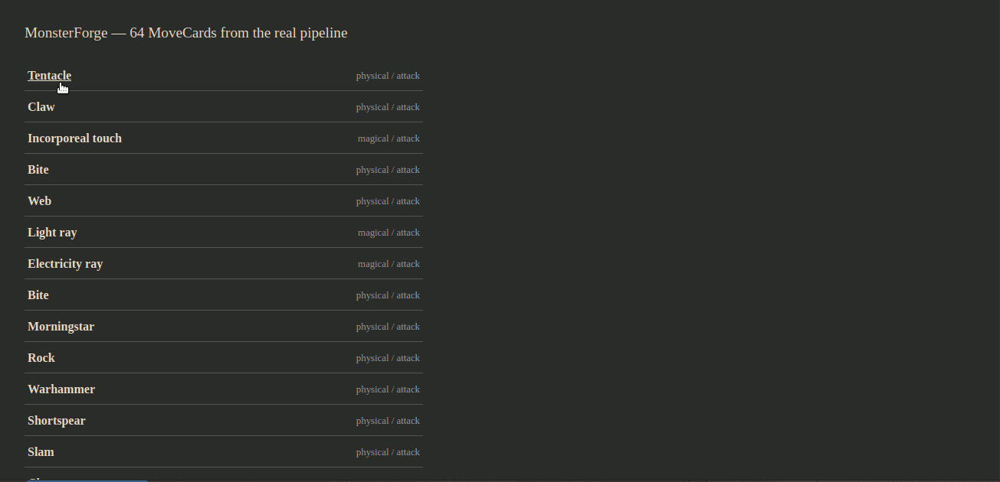

# MonsterForge — RPG Data Transformation Engine

A Python-based pipeline that transforms semi-structured RPG data into normalized, game entities through deterministic rules and LLM-assisted classification.

---

## Current Status

The project is under active development. A first vertical slice — converting a
single D&D 3.x attack all the way from raw input to a domain `MoveCard`,
classified live against the real Gemini API — works end to end today via CLI
tools, and that `MoveCard` can now be rendered into an actual printable
HTML/CSS card. Persistence, the HTTP API, and human validation are designed
in detail but not yet built.

For the full, up-to-date picture (what's implemented, test coverage, known
limitations) see **[monsterforge/docs/PROJECT_STATUS.md](./monsterforge/docs/PROJECT_STATUS.md)**.
The rest of this README describes the project's overall vision and design —
where it's headed, not only where it stands right now.

---

## Overview

MonsterForge is a domain-specific data transformation pipeline that converts complex RPG stat blocks (D&D 3.5 / Pathfinder 1E) into simplified, playable card-based representations.

The system focuses on preserving functional identity, relative power, and gameplay usability, rather than performing a lossless conversion.

It combines:

- deterministic numerical transformations
- LLM-based semantic classification
- human-in-the-loop validation

to produce consistent and explainable outputs.

> Full design documentation (conversion algorithms, classification schema, card system) is available in **[DESIGN.md](./DESIGN.md)**.

---

## Demo

**[Browse the MoveCard gallery — TODO: GitHub Pages link]** — every card the
project has produced against the real Gemini API, browsable in one page, each
with a drill-down into its raw input, LLM classification, and JSON. See
**[monsterforge/docs/RENDERING_AND_GALLERY.md](./monsterforge/docs/RENDERING_AND_GALLERY.md)**
for what it demonstrates.

A card as the pipeline actually renders it today (left) next to the same
template with artwork (right) — art sourcing isn't part of the pipeline yet,
this is a manually-supplied image showing the template supports one:

| Rendered by the pipeline (no artwork) | Same template, with artwork (not pipeline-generated) |
|---|---|
|  |  |

Clicking a card in the gallery opens a drill-down into its raw input, LLM
classification, JSON, and rendered card:



The CLI entry points (see [Example Usage](#example-usage)) produce the same
data a rendered card draws from, as JSON.

---

## Problem

RPG stat blocks are:

- highly complex
- semi-structured
- inconsistent across sources
- not directly usable in fast-paced game systems

Converting them into a simplified format requires:

- normalization of numerical values
- abstraction of mechanics
- interpretation of textual abilities

---

## Solution

MonsterForge implements a pipeline that:

1. Extracts raw RPG data from web sources
2. Parses and structures stat blocks
3. Transforms numerical values via deterministic rules
4. Classifies abilities using an LLM with a constrained schema
5. Applies human validation when confidence is low
6. Generates card-based representations, exposed via a JSON API and rendered as printable cards

---

## Architecture

The system can be viewed as a domain-specific ETL pipeline:

```
Raw RPG Data (HTML / OGL)
        |
        v
Parser
        |
        v
Structured Data
        |
        +----------------------+
        |                      |
        v                      v
Numerical Transformation   LLM Classification
        |                      |
        +----------+-----------+
                   |
                   v
          Human Validation
                   |
                   v
        Intermediate Entity Model
                   |
                   v
             Serialization
                   |
          +--------+--------+
          |                 |
          v                 v
     JSON API          Card Rendering
     (FastAPI)          (HTML / Image)
```

This pipeline follows an ETL-like structure where transformation is split between deterministic algorithms and constrained semantic classification. After the domain model, the pipeline forks into two independent consumers sharing one serialized representation — see [PIPELINE_ARCHITECTURE.md](./monsterforge/docs/PIPELINE_ARCHITECTURE.md) for the full schema and the rationale behind that split.

---

## Key Design Principles

**Lossy Transformation**

The system intentionally reduces complexity:

- preserves gameplay-relevant identity
- removes unnecessary mechanical detail

**Deterministic vs Probabilistic Separation**

- Numerical data → deterministic algorithms
- Semantic data → LLM classification
- Final control → human validation

This ensures consistency, controllability, and explainability.

**Configuration as Code**

Conversion tables (size → HP, characteristic → attribute, skill → interpretation group) are modeled as typed dataclasses rather than external config files. Since balance rules are logic, not just data, keeping them in code (with shared, reusable calculation functions) avoids the false flexibility of a config layer that would still require code changes for most real adjustments.

**Intermediate Representation**

The pipeline does not convert directly from source to output:

```
RPG Data → Entity Model → Cards
```

This allows extensibility, multiple output formats, and decoupling from source systems.

---

## Features

Built and working today:

- Deterministic parsing of D&D 3.x attack notation (dice, damage types, critical hits, secondary effects) via regex, no LLM involved where the format is fixed
- Semantic classification of attack descriptions via the Gemini API, with explicit handling when the configured model becomes unavailable (no silent fallback — see [LLM_ARCHITECTURE.md](./monsterforge/docs/LLM_ARCHITECTURE.md))
- Full conversion path from raw attack input to a domain `MoveCard`, including secondary/referenced cards (e.g. a bite granting Trip)
- CLI entry points for manual input, prompt iteration, and batch data collection against the real API
- Card rendering pipeline (`MoveCard` → printable HTML/CSS card), plus a static gallery browsing every card produced against the real API with a raw-input/classification/JSON drill-down per card

Planned, not yet built:

- Web scraping with `requests` + `BeautifulSoup`
- SQL persistence of raw and structured data
- A JSON API (FastAPI) exposing the domain model
- Confidence-based human validation workflow

---

## Example

**Input (simplified)**

```
Wolf
Medium Animal
HD: 2d8
STR 13, DEX 15, CON 15
INT 2, WIS 12, CHA 6
Attack: Bite 1d6
```

**Output (simplified)**

```
CREATURE CARD
HP: 23
Attack: 1        Speed: 2        Defense: 2
Power: 0         Ward: 1         Flow: 0
Athletics: 2     Empathy: 0      Perception: 2
Stealth: 2       Knowledge: 0    Crafting: 0

MOVE CARD
Name: Bite
Type: Physical | Category: Attack | Mode: Active
Effect: Deal 3 damage to a single target
Cost: 1 Stamina
```

Full attribute derivation (HP, Body/Spirit, Interpretation) is documented in [DESIGN.md](./DESIGN.md).

---

## Pipeline Execution Example

A typical pipeline execution is designed to produce traceable logs for each transformation stage:
```text
[2026-07-10 14:32:01] INFO  Loading raw record: monster_id=wolf_001 source=d20srd
[2026-07-10 14:32:01] INFO  Parsing stat block...
[2026-07-10 14:32:01] INFO  Structured data extracted: 6 abilities, 8 skills, 1 attack
[2026-07-10 14:32:01] INFO  Applying numerical transformations (HP, Body, Spirit, Interpretation)...
[2026-07-10 14:32:02] INFO  HP=23  Attack=1  Speed=2  Defense=2
[2026-07-10 14:32:02] INFO  Classifying ability: "Bite" via LLM...
[2026-07-10 14:32:03] INFO  Classification result: confidence=0.94 -> auto-approved
[2026-07-10 14:32:03] INFO  Classifying ability: "Keen Scent" via LLM...
[2026-07-10 14:32:04] WARN  Low confidence classification: ability="Keen Scent" confidence=0.61 -> flagged for manual review
[2026-07-10 14:32:04] INFO  Queued for human validation: 1 item
[2026-07-10 14:32:10] INFO  Human validation completed: 1 approved, 0 corrected
[2026-07-10 14:32:10] INFO  Building intermediate entity model...
[2026-07-10 14:32:11] INFO  Generating card templates (1 creature, 2 moves)...
[2026-07-10 14:32:11] INFO  Export completed: creature_card.html, bite_card.html, keen_scent_card.html
```
Logging makes each transformation stage observable and simplifies debugging, validation, and future rule changes. This is a mock-up of the target end-to-end flow and its intended log output — no logging system exists yet either, and scraping and validation aren't built, see [Current Status](#current-status).

---

## Project Structure

```
monsterforge/
├── domain/            # core models (entity, card, ability) — the final,
│                       # source-independent representation
├── serialization/      # domain model → external representation (JSON-
│                        # compatible dict), shared by api/ and rendering/
├── rendering/           # MoveCard → printable HTML/CSS card, and the
│                          # real-sample gallery page
├── config/             # runtime settings (LLM API key, confidence thresholds, DB config — see .env.example) (planned)
├── db/                  # DB schema and access (raw scraped content, generic table) (planned)
├── rules/                 # typed conversion tables (dataclasses: size→HP, characteristic→attribute, ...)
├── scraping/                # HTML acquisition (requests + BeautifulSoup), writes to db/ (planned)
├── parsing/                   # extraction + conversion, per RPG system and edition
│   └── dnd/v3x/
│       ├── raw_fields/          # stage 1: mirrors rulebook tables almost verbatim
│       │                          (e.g. RawArmorFields, RawCreatureFields — still
│       │                          mostly strings, not yet cast or interpreted)
│       └── structured_conversions/ # stage 2: casts raw_fields into structured_data,
│                                    routing free-text content to llm/ when needed
├── structured_data/               # typed, source-specific intermediate models
│   └── dnd/v3x/                    # (Creature, Item, Spell, Feat, ...) — the
│                                     "Dati Strutturati" stage from DESIGN.md
├── transformation/                  # numerical algorithms (HP, Body/Spirit, Interpretation)
├── llm/                               # semantic classification (attacks, qualities, feats, spells)
├── pipeline/                           # orchestration (e.g. attack_pipeline.convert_attack)
├── entrypoints/                         # CLI tools: manual conversion, prompt testing,
│                                          real-API data collection
├── validation/                          # human review logic (planned)
├── api/                                  # JSON API, FastAPI (planned)
└── tests/                                  # unit tests
```
**Two-stage parsing.** Extraction is split into `raw_fields/` (source-format
strings, mirroring the rulebook table structure) and a conversion stage that
casts and normalizes into `structured_data/`. This decouples the fragile,
source-specific part of parsing (HTML layout, per-site formatting) from
interpretation and typing, and means:

- multiple scraping sources can converge on the same `raw_fields` shape
  before any interpretation happens;
- **manual input is a first-class path, not a workaround** — a `raw_fields`
  instance can be populated directly (CLI, or a future form) instead of
  scraped, letting a user hand-enter a custom weapon or character and still
  get a generated card, bypassing scraping entirely;
- simple entries with no free-text description can skip LLM classification
  and go straight to `structured_data` via direct type casting.

See **[PIPELINE_ARCHITECTURE.md](./monsterforge/docs/PIPELINE_ARCHITECTURE.md)** for the
full pipeline schema and the rationale behind this split.

---

## Example Usage

What runs today, against the real Gemini API:

```bash
python -m monsterforge.entrypoints.convert_attack_cli
```

Prompts for a raw attack (and optional context) interactively, then prints
the resulting `MoveCard` as JSON.

```bash
python -m monsterforge.entrypoints.test_llm_prompt_cli
```

Renders any Jinja2 prompt template with real input and prints the LLM's raw
response — useful for iterating on prompts directly.

The target CLI shape once the full pipeline exists:

```
python -m monsterforge generate --entity wolf
```

```
Generated:
- creature_card.html
- bite_card.html
```

---

## LLM Integration

The LLM is used strictly as a semantic classifier, not a generator.

- Fixed output schema
- Low temperature
- Confidence scoring
- Automatic fallback to human validation when confidence < threshold (planned; today confidence is captured but not yet routed anywhere)

Example output *(simplified — see [DESIGN.md](./DESIGN.md) for the full schema, including duration, usage, and card fields)*:

```json
{
  "type": "Physical",
  "category": "Attack",
  "mode": "Active",
  "target": "Single",
  "resource": "Stamina",
  "confidence": 0.92
}
```

See [LLM_ARCHITECTURE.md](./monsterforge/docs/LLM_ARCHITECTURE.md) for how the model is
selected, verified, and what happens when it becomes unavailable.

---

## Development

```bash
pip install -r requirements.txt
pytest
```

<!-- Add linting/formatting tools here if used, e.g.: -->
<!-- Code style: `ruff` / `black` -->

---

## Testing

Tests ensure that transformation rules remain stable as the system evolves.

The project includes unit tests for:

- numerical transformations
- attribute mapping
- edge cases
- pipeline consistency

Example (target shape, once full creature conversion exists — see below):

```python
def test_wolf_conversion():
    monster = load_monster("wolf")
    card = convert(monster)

    assert card.hp == 23
    assert card.attack == 1
```

This illustrates the target testing style for a full creature pipeline,
which isn't built yet — only the attack-level pipeline is (see
[Current Status](#current-status)). The `hp == 23` figure isn't
invented: it's the project's actual "Wolf" worked example from
[DESIGN.md](./DESIGN.md), already a real regression anchor for the HP
calculation specifically
(`tests/transformation/dnd/v3x/calculations/test_vitality.py::test_wolf_vitality_matches_design_doc_example`),
just not yet wired to a single end-to-end `convert()` call like this.

---

## Limitations

- Final game balance requires playtesting
- Some semantic edge cases require manual validation
- Not all RPG mechanics are fully represented
- Designed primarily for D&D 3.5 / Pathfinder 1E
- Full game ruleset is intentionally out of scope — this project is a transformation engine, not a game
- See [PROJECT_STATUS.md](./monsterforge/docs/PROJECT_STATUS.md) for what's concretely built vs. still planned

---

## Future Improvements

- HTTP API (FastAPI) exposing the domain model as JSON
- CLI-based human validation workflow for low-confidence classifications
- Transformation versioning system
- Support for additional RPG systems
- Advanced balancing heuristics
- Batch processing pipeline

---

## Tech Stack

Currently used:

- Python
- `google-generativeai` (Gemini API)
- Jinja2 (LLM prompts, and HTML/CSS card + gallery templates)
- Bootstrap 5 / highlight.js (via CDN, gallery page UI only — not a pip dependency)
- dataclasses
- pytest

Planned:

- requests / BeautifulSoup
- SQLite / SQLAlchemy
- FastAPI

---

## Why This Project

This project is designed to demonstrate real-world software engineering patterns applied to a non-trivial domain:

- data pipeline design (ETL)
- transformation of semi-structured data
- domain modeling
- integration of deterministic and AI-driven components
- human-in-the-loop system design
- end-to-end software architecture

---

## Documentation

- **[DESIGN.md](./DESIGN.md)** — original technical vision: architecture, transformation algorithms, intermediate data model, and LLM classification workflow
- **[monsterforge/docs/PROJECT_STATUS.md](./monsterforge/docs/PROJECT_STATUS.md)** — current state: what's built, test coverage, known limitations
- **[monsterforge/docs/MVP_ZERO.md](./monsterforge/docs/MVP_ZERO.md)** — case study: what the first working vertical slice (Attack → MoveCard) demonstrates about the project's engineering approach
- **[monsterforge/docs/RENDERING_AND_GALLERY.md](./monsterforge/docs/RENDERING_AND_GALLERY.md)** — case study: turning a MoveCard into a printable card, and browsing real pipeline output in a gallery
- **[monsterforge/docs/PIPELINE_ARCHITECTURE.md](./monsterforge/docs/PIPELINE_ARCHITECTURE.md)** — full pipeline schema and architectural decisions
- **[monsterforge/docs/LLM_ARCHITECTURE.md](./monsterforge/docs/LLM_ARCHITECTURE.md)** — how the LLM client layer is structured

---

## License & Data Sources

The codebase in this repository is original work.

Monster and rule data are derived from sources released under the **Open Game License (OGL)**. No proprietary, non-OGL content is scraped, stored, or redistributed. This project is a technical/portfolio project and does not aim to reproduce or distribute copyrighted game material beyond what OGL permits.
