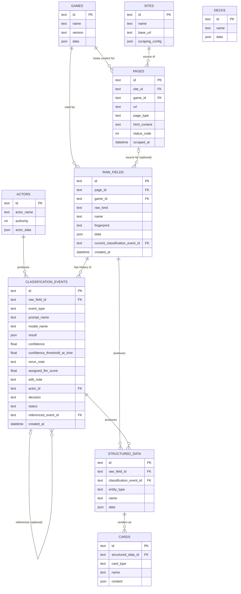

# Persistence — Caching a Classification, Not Just Storing One

A case study in what a persistence layer actually needs to model when
the thing being cached is a semantic judgment call, not a fixed
computation — and in treating a cache hit as free, not merely fast. See
[PROJECT_STATUS.md](./PROJECT_STATUS.md) for current test counts.

**See it live:** submit the same attack twice at
<https://monsterforge-tohp.onrender.com/convert> — the second submission
returns instantly, no LLM call, the identical card id both times.

## What it is

```
An attack submission
        |
        v
A deterministic fingerprint (hash of the mechanical fields only)
        |
        v
An append-only log, in SQLite via SQLAlchemy, of every classification
attempt and human decision made about it
```

Nine tables, one relational database (SQLite for now, SQLAlchemy as the
abstraction layer so a later move to Postgres is a connection-string
change, not a rewrite). The core chain a single attack submission moves
through:

```
┌──────────────────────────────────────────────────────────────────────────┐
│  raw_fields                                                              │
│     The submission itself — keyed by a fingerprint hashed from its       │
│     mechanical fields only, so an identical resubmission is recognized   │
└──────────────────────────────────────────────────────────────────────────┘
                              |
                              v
┌──────────────────────────────────────────────────────────────────────────┐
│  classification_events                                                   │
│     One row per LLM run or human decision (approve/correct/reject) —     │
│     append-only, never overwritten. raw_fields always points back at     │
│     whichever row here is currently active — never just the newest one,  │
│     since a human decision can supersede a later, unreviewed LLM attempt │
└──────────────────────────────────────────────────────────────────────────┘
                              |
                              v
┌──────────────────────────────────────────────────────────────────────────┐
│  structured_data                                                         │
│     Typed output of the currently active classification_events row       │
└──────────────────────────────────────────────────────────────────────────┘
                              |
                              v
┌──────────────────────────────────────────────────────────────────────────┐
│  cards                                                                   │
│     The final, rendered card                                             │
└──────────────────────────────────────────────────────────────────────────┘
```

Both `structured_data` and `cards` link back to the *specific*
classification event that produced them, not just the attack in
general — so a later reclassification produces new rows down the whole
chain instead of overwriting history.

### What each table is for

| Table | What it holds |
|---|---|
| `games` | Which game system/edition a submission belongs to — D&D 3.x today, room for others later without changing any other table. |
| `sites` / `pages` | Where a submission was scraped from — the source site and the specific page — when it wasn't typed by hand. |
| `actors` | Who or what produced a `classification_events` row. Two rows exist today: the LLM (`authority=0`, always lowest) and the project's one human reviewer (`authority=10`) — the gap between them leaves room for future intermediate levels (a second reviewer, an editor) without renumbering anything. Every event has a real actor row, including automated ones — no special-cased "no actor" for the LLM. |
| `raw_fields` | One row per distinct submission, deduplicated by `fingerprint`. `current_classification_event_id` points at whichever `classification_events` row is the currently active result — not necessarily the newest one. |
| `classification_events` | The append-only log itself — one row per LLM run or human decision (approve/correct/reject). `status` is the only column ever changed after a row is written. |
| `structured_data` | The typed, cast version of a raw field's data — tied to the *specific* classification event that produced it, not just to the attack in general. |
| `cards` | The final rendered output — one row per card, linked to the structured data it came from. |
| `decks` | A complete unit of play (a full monster or character) assembled from multiple cards — the schema exists, but no conversion path populates it yet. |

### Every field, and every foreign key between the nine tables



Most tables have few relational columns and one JSON column (`data`/
`result`/`content`) holding the actual object — a handful of fields for
whatever needs filtering, joining, or ordering, everything else in the
blob. `raw_fields.fingerprint` and `pages.url` are the two columns
enforced `UNIQUE`; every other relationship above is a plain foreign
key, checked at the database level (SQLite disables that by default —
enforcing it took an explicit, separately verified fix).

## What it demonstrates

**A cache key tuned for actual hit rate, not just correctness.** The
fingerprint deliberately excludes free-text context
(`additional_description`/`creature_description`) even though the LLM
prompt does use them: a wolf and an orangutan sharing an identical
mechanical "bite" almost never share identical descriptive text, so
including it would make the cache miss on cases that are, for
classification purposes, the same attack — defeating the point of
caching at all. The one context field kept, `creature_subtype`, earns
its place differently: the prompt gives it a rigid, deterministic rule
("incorporeal" always forces a magical classification), not just
influence over the model's judgment the way free text does. A narrower,
"more correct" fingerprint was considered and rejected for producing an
almost-useless cache in practice.

**An append-only event log, not a "current value" column.** Every LLM
run and every human decision (approve/correct/reject) accumulates as its
own row, discriminated by an event type, rather than overwriting a
single "result" field. The one exception is deliberate and narrow: a
`status` flag tracking which row is currently active, since "is this
still the current result" is a question whose answer legitimately
changes over time, unlike the rest of a row's historical record. A
rejected attack is recognized on a later identical submission the same
way an approved one is — the log tracks the most recently resolved
state, not only outcomes that produced a card.

**Failing loudly on an inconsistency instead of quietly working around
it.** If a raw field's active classification event somehow has no saved
card behind it (a save interrupted mid-pipeline, for instance), the
lookup raises a specific error rather than silently reclassifying as if
nothing had happened — the same principle already applied elsewhere in
this project to a different kind of failure (an attack range the
classifier couldn't resolve): a loud, specific failure beats a plausible
guess standing in for a real answer.

**A cache hit costs nothing extra, deliberately.** On a repeat
submission, nothing gets recomputed and nothing gets written — the
already-saved card content is handed to the same renderer a fresh
submission would eventually reach, unchanged. Getting there took a
real design correction: an earlier version of this cache regenerated
the card object on every hit (cheap, since it involves no LLM call) and
patched its identifier to match the saved one, which works but does
strictly more than necessary for information that's already sitting in
the database in exactly the shape the renderer wants.

## Verified against the real pipeline

Confirmed against the live deployment, not just the test suite: the
same attack submitted twice through the deployed web form returns the
identical card id both times, with the second request completing
without a real Gemini API call. Locally, the same scenario is a
permanent regression test — a repeat submission asserted to trigger no
second classification call and to return the same saved result — along
with the inconsistency-handling path, exercised by deliberately removing
a saved card out from under an active classification and confirming the
lookup fails loudly rather than silently reclassifying.

## What's deliberately out of scope

The CLI conversion path (`entrypoints/convert_attack_cli.py`) doesn't
use this cache yet — only the web form does. The CLI is due for a
broader pass bringing it in line with several web-only capabilities at
once, this one included, rather than picking it up in isolation now.

Scraped source pages aren't part of this persistence layer yet either —
today every submission is either typed by hand or seeded from the demo
form's sample list, never pulled from a live source site.
