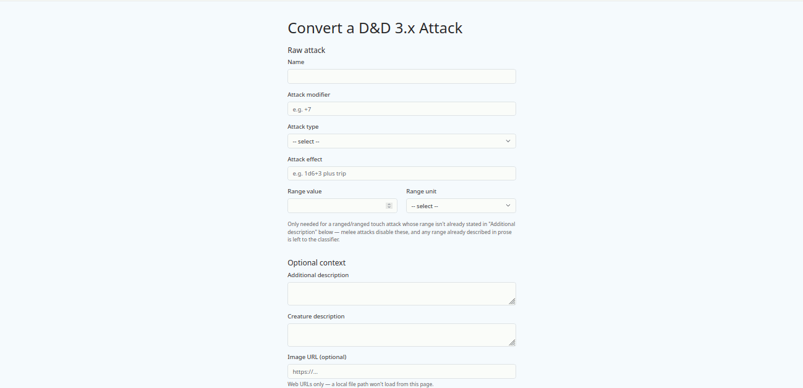

# Web UI & Human Review — Convert and Correct a Card Over HTTP

For the underlying conversion pipeline itself, see
[MVP_ZERO.md](./MVP_ZERO.md). For how a `MoveCard` becomes a printable card,
see [RENDERING_AND_GALLERY.md](./RENDERING_AND_GALLERY.md). This document
covers the layer on top of both: the same conversion, now reachable over the
web, with a human review step in between classification and the final card.

## What it is

**[Try it live](https://monsterforge-tohp.onrender.com/convert)** — a form
where you type in a D&D 3.x attack (name, attack bonus, melee/ranged, the
effect text, optional context) and get back a rendered card. Free-tier
hosting: the first request after a period of inactivity can take ~30–50s
to wake up while the server restarts.

Behind the form, the exact same pipeline as the CLI runs: the LLM
classifies the attack (move type, description, range), and if its
confidence is below a threshold — or if you tick "Always review" yourself —
the classification is shown to you before it becomes a card, with four
choices:

- **Approve** — accept the classification as-is.
- **Correct** — edit the description, move type, or range directly, then
  build the card from your correction instead of the LLM's own output.
- **Reject** — discard it, no card is produced.
- **Rerun** — reclassify from scratch, optionally with an extra note or a
  different prompt template (see below), and review the new result under
  the same menu.

A card that was auto-approved (confidence was high enough to skip review)
still has a correction path — "Edit this classification" on the rendered
card reopens the same review form without reclassifying.

## What it demonstrates

- **Confidence-gated human review as a real, usable step**, not just a
  design on paper — the reviewer sees the raw attack, the full context sent
  to the LLM, which prompt template was used, and the complete
  classification (including the LLM's own confidence score and rationale)
  before deciding.
- **Choosing which prompt template classifies the attack**, on first
  classification and again on rerun: the baseline template, one that keeps
  the LLM from re-describing the creature in the attack's own description,
  one that lowers confidence when key information is missing, and one
  combining both.
- **An optional image URL**, rendered on the final card — must be a real
  `http(s)://` link (see [Out of scope](#whats-deliberately-out-of-scope)
  below for why a local file path doesn't work).
- **Friendly error handling instead of a raw crash**: an unresolvable range,
  an unavailable LLM model, or any other classification failure re-shows the
  form you were already on with a plain-language error banner and whatever
  you'd already entered — never a dead end or a lost place in the flow.

## Writing a valid attack

The `Attack effect` field is parsed deterministically (regex, not the LLM)
into damage, critical-hit notation, and secondary effects. A few concrete
rules make the difference between a value being read as damage versus a
named special attack:

| You write | It becomes |
|---|---|
| `1d6+3` | 1d6+3 physical damage (untyped dice defaults to physical) |
| `1d8 fire` | 1d8 fire damage |
| `5 bludgeoning` | 5 flat bludgeoning damage |
| `5` | 5 flat **physical** damage — a bare number with no type also defaults to physical |
| `1d4 Wisdom drain` | 1d4 damage to the target's Wisdom score |
| `1d6+3 plus trip` | 1d6+3 physical damage, plus a separate "trip" special attack card |
| `paralysis` | a "paralysis" special attack, no damage component at all |

**The one genuinely ambiguous case**: a single word with no dice and no
number always becomes a special attack name, even if that word happens to
be a recognized damage-type keyword — `positive energy` or `energy drain`
on their own become special attacks named exactly that, not damage, because
they carry no quantifiable value. Pairing the same word with a number or
dice expression (`1d6 positive energy`, `5 acid`) makes it damage instead.

**Recognized damage types** (case-insensitive, always in English —
`bludgeoning`, `slashing`, `piercing`, `physical`, `fire`, `cold`, `acid`,
`electricity`, `sonic`, `disintegration`, `force`, `negative energy`,
`positive energy`, `energy drain`. Anything outside this list, with no
dice/number attached, is treated as a special attack name — this is by
design, not a parsing gap: the deterministic parser only recognizes a fixed
D&D 3.5 vocabulary, and an unrecognized word is exactly what a special
attack name looks like.

Attack type is a constrained dropdown (`melee`, `melee touch`, `ranged`,
`ranged touch`) rather than free text, specifically because a value the
parser doesn't recognize (e.g. a non-English word) used to silently fall
back to "ranged" instead of failing loudly. A ranged or ranged-touch attack
needs a resolvable range — either the structured range value/unit fields,
or prose that already states one (e.g. in "Additional description").

## Verified against the real pipeline

Deployed and tested end to end against the real Gemini API, not mocked —
including triggering the review branch, correcting a classification,
rerunning with a different prompt template, and rendering a card with a
user-supplied image URL, all through the live form rather than the test
suite alone.

## What's deliberately out of scope

- **Rate limiting** — the deployed instance calls the real Gemini API on a
  free-tier key with no billing attached, so the only realistic risk is
  temporary quota exhaustion, not cost. Deferred deliberately for now, not
  forgotten.
- **Local images** — the optional image field accepts only a web URL.
  Browsers block a page served over `http(s)://` from loading a `file://`
  resource, so a local file path silently fails to load; serving local
  images would need the server to expose them over its own HTTP route,
  which doesn't exist yet.
- **Persistence** — every conversion is computed fresh; there's no database,
  no stable card ID across runs, and a review decision isn't remembered
  anywhere once you leave the page.
- **Rerun's prompt-template choice, not its model choice** — you can pick
  which prompt classifies the attack on rerun, but not yet which LLM model
  answers it.
